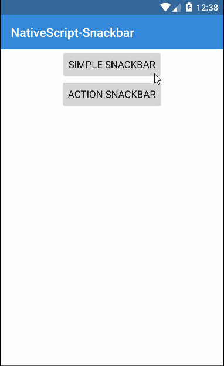

[](https://www.npmjs.com/package/nativescript-snackbar)
[](https://www.npmjs.com/package/nativescript-snackbar)

# NativeScript Snackbar :lollipop: :chocolate_bar:

Use the Material Design Snackbar in your {N} app, iOS uses [SSSnackbar Cocoapod](https://github.com/stonesam92/SSSnackbar)

### Snackbar Usage 



## Installation
`npm install nativescript-snackbar`

## Usage

```JS
var snackbar = require("nativescript-snackbar");
```

### Show a simple snackbar with no actions (Except close on iOS, limitation of the Cocoapod)
```JS
snackbar.simple("I Love NativeScript!").then(function(result) {
    console.log(result);
});   
```

### Note: To change the "Close" text on iOS edit the info.pList

### Show a snackbar with Actions

```JS
// Set the options
var options = {
    // The snackText here is the main text to display with the snackbar. (REQUIRED)
    snackText: "Emails Deleted.", 
    // Time in ms before it hides/animates out of view (OPTIONAL).
    hideDelay: 3000,
    // The actionText will appear on the right side and is interactive if the user taps it before the snackbar hides (REQUIRED, if null defaults to .SIMPLE snackbar)
    actionText: "UNDO",
    actionTextColor: "#FF4081", // ANDROID ONLY (OPTIONAL), internally checks for android
};

// Open the snackbar
snackbar.action(options)
        .then(function(args){
            //Returns a promise
            if(args.command == "Action"){
                //Action
            }else {
                //Dismissal or timeout
            }  
        });
});   
```

### Manually Dismiss an active snackbar
```JS
snackbar.dismiss();
```

### Contributors

- Steve McNiven-Scott  [@stevemcniven](https://twitter.com/stevemcniven)
- Nathanael Anderson [@CongoCart](https://twitter.com/congocart)
