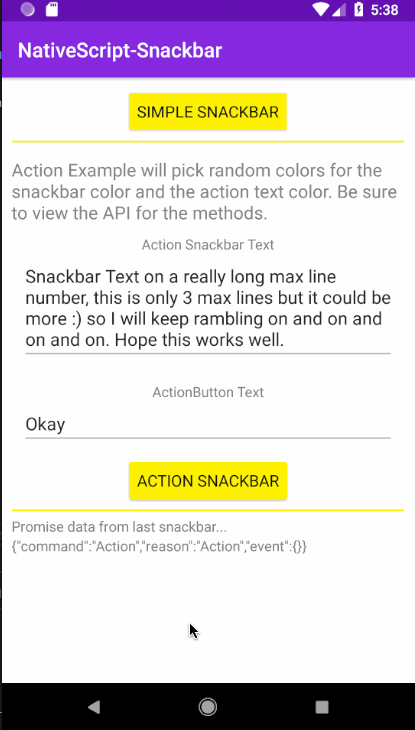

[](https://www.npmjs.com/package/nativescript-snackbar)
[](https://www.npmjs.com/package/nativescript-snackbar)

# NativeScript Snackbar :lollipop: :chocolate_bar:

Use the Material Design Snackbar in your {N} app, iOS uses [SSSnackbar Cocoapod](https://github.com/stonesam92/SSSnackbar)

### Snackbar Usage 



## Installation
`tns plugin add nativescript-snackbar`

## Usage


### TS

```TS

import { SnackBar, SnackBarOptions } from "nativescript-snackbar";

// Create an instance of SnackBar
let snackbar = new SnackBar();

/// Show a simple snackbar with no actions
public showSimple() {
    snackbar.simple('Snackbar', 'red', '#fff').then((args) => {
         this.set('jsonResult', JSON.stringify(args));
   })
}

/// Show an Action snack bar
public showAction() {
  let options: SnackBarOptions = {
    actionText: this.get('actionText'),
    actionTextColor: '#ff4081', // Optional, Android only
    snackText: this.get('snackText'),
    hideDelay: 3500,
    textColor: '#346db2', // Optional, Android only
    backgroundColor: '#eaeaea' // Optional, Android only
  };

  snackbar.action(options).then((args) => {
    if (args.command === "Action") {
      this.set('jsonResult', JSON.stringify(args));
    } else {
      this.set('jsonResult', JSON.stringify(args));
    }
  });
}

```

### API

Show a simple SnackBar (color args will only work on Android)
- **simple(snackText: string, textColor?: string, backgroundColor?: string): Promise<any>**

Show a SnackBar with Action.
- **action(options: SnackBarOptions): Promise<any>**

Manually dismiss an active SnackBar
- **dismiss(): Promise<any>**


### SnackBarOptions Interface

- **actionText: string**
- **actionTextColor: string**
- **snackText: string**
- **hideDelay: number**
- **textColor: string**
- **backgroundColor: string**


### Contributors

- Steve McNiven-Scott  [@stevemcniven](https://twitter.com/stevemcniven)
- Nathanael Anderson [@CongoCart](https://twitter.com/congocart)
- Marc Buils [MarcBuils](http://www.marcbuils.fr/)
- Davor Peic [@davorpeic](https://twitter.com/davorpeic)
- Eddy Verbruggen [@eddyverbruggen](https://twitter.com/eddyverbruggen)